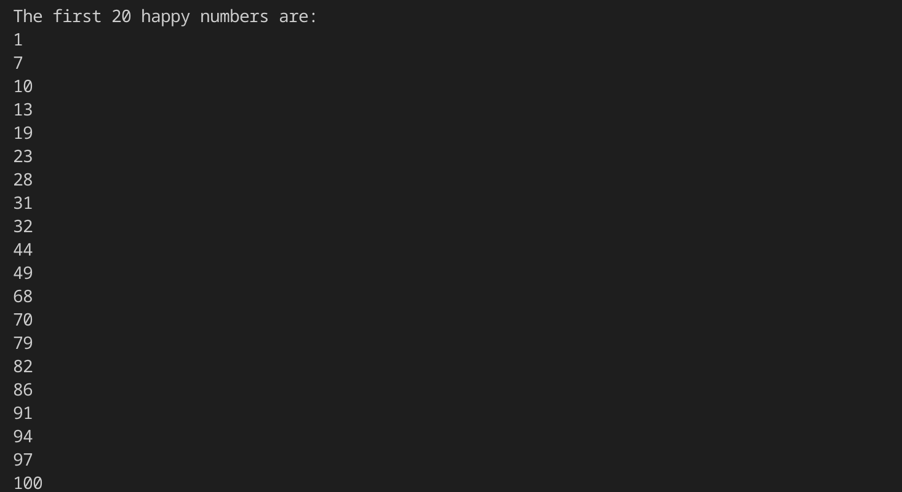

# Challenge 9 - Happy Numbers

A function to check if a number is a 'happy number' or not.  
A 'happy number' is a positive integer which reaches 1 if repeatedly substituted for the sum of its digits' squares.  
Th function carries out this operation and keeps track of which numbers have previously been visited to detect loops that do not include 1.

