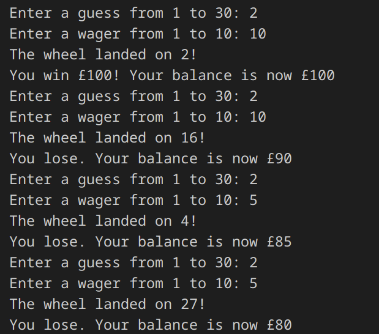

# Challenge 35 - Game of Chance

A Program to simulate a roulette - like game of chance. The user can choose a random number from 1 to 30 and wins differing amounts depending on the qualities of the number, but only if a random chosen number from 1 to 30 is the same as their chosen number.

